# Stack
This data structure is best described as controlled by the order that items are added to the stack, or removed from it. The data can only be changed in order, meaning that it can only be removed in the reverse order that it was added. Items cannot be taken from the middle of the stack.  

A stack in C# is written by first creating an empty stack within a function.
In order to add items to the stack, the push method is utilized. When the stack is printed out, these items will be listed in the reverse order that they were added.
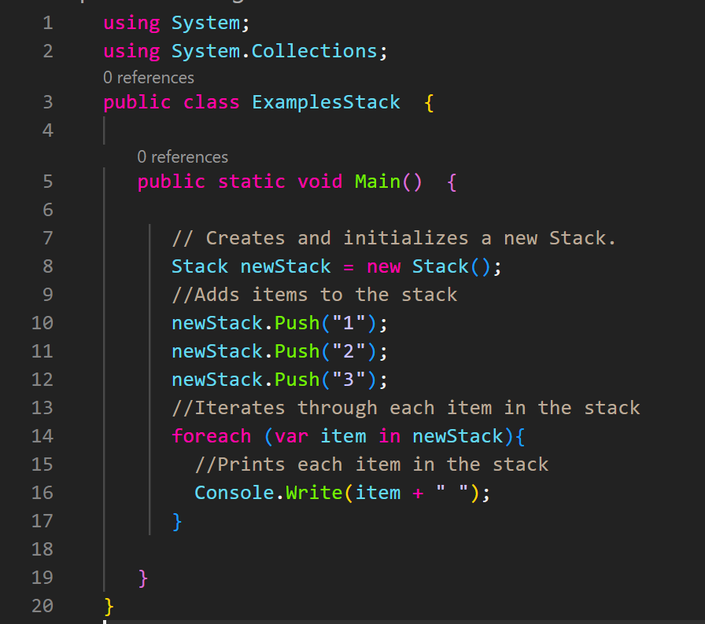  
## Last in, First Out
As mentioned above, items can only be added or removed at the end of the stack. Doing anything to the stack starting from the middle is generally not allowed.  

In order to remove a item from the stack, the pop method is utilized. This will remove the last item in the stack, or more items, depending on how many the user specified. Even if more than one item is removed, the item that was most recently added will be removed first, with any following items also being removed in the reverse order that they were added.  
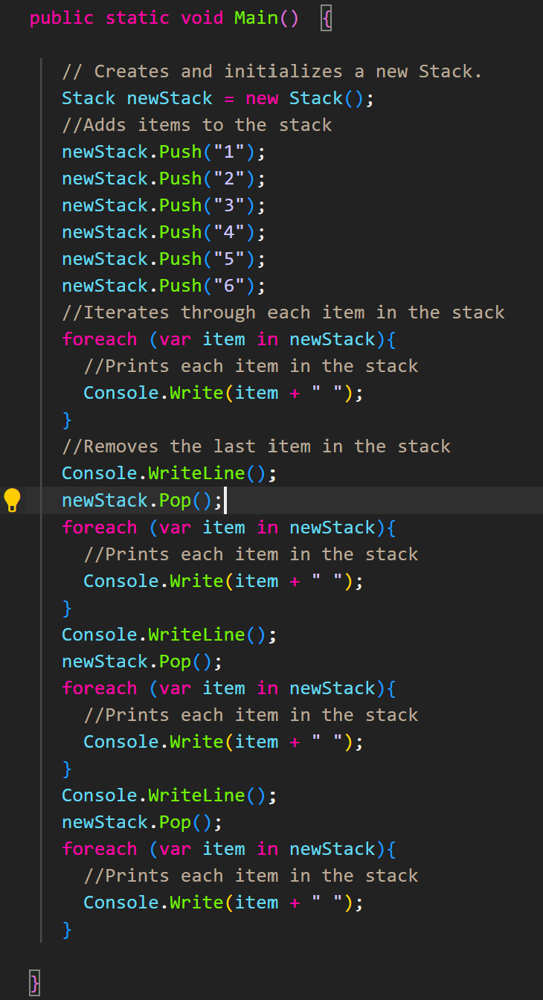  
These are the results for the example above.  
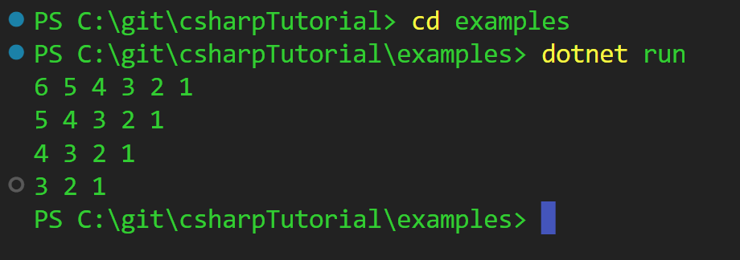  
## Push, Pop, and Clear  
The push and pop methods have already been introduced in this tutorial, but we're going to go into a little more detail about them, as well as talk a little about the clear method. The push and pop methods are essentially opposites. Push adds an item to the stack, pop removes one. Clear is very similar to pop, except it removes all the items in the stack, rather than simply the last one pushed.  
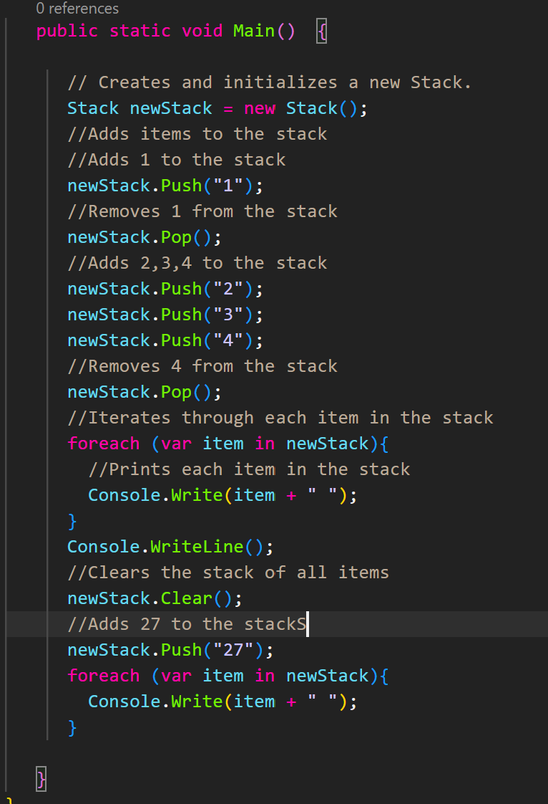  
Here are the results for the above example
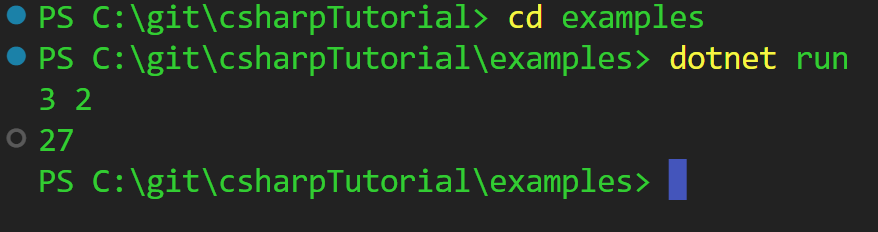  
## Top to Bottom  
One problem with using stacks is that the results are printed in reverse, so if you are doing something that involves things being written in a certain order, it will probably cause problems. There is a relatively simple fix for this. It involves creating another stack, and then pushing the items into that stack, while at the same time popping them from the first stack. At the completion of this process, after you iterate the items in the second stack, the items will print in the order they were pushed into the first stack.  
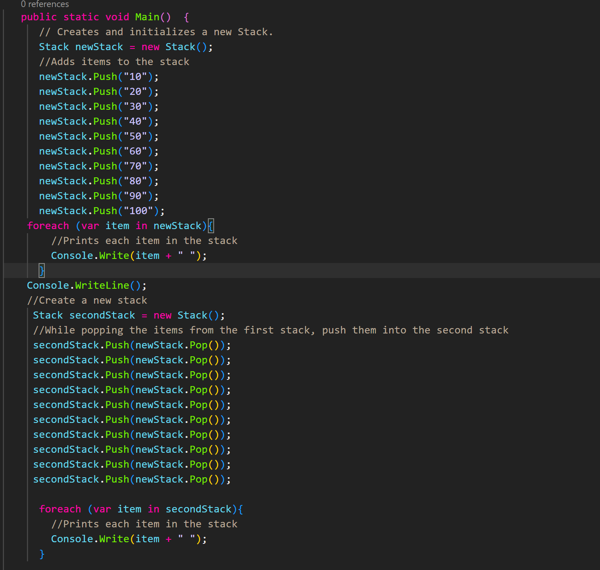  
Results for example 4
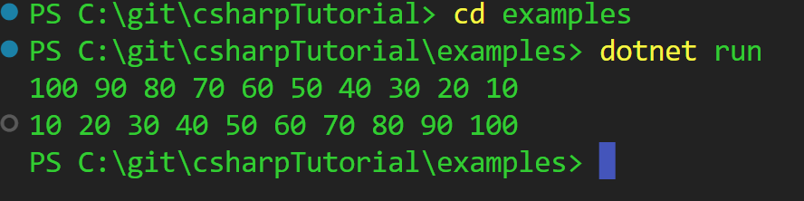  
## Example: Complete Sentence  
In this example, I will demonstrate a simple stack program.  
This program should:
- Create a new stack.
- Push the words to the sentence.  
- Pop the words and at the same time, push them into a new stack, so that they are in the correct order.
- Print the sentence.  
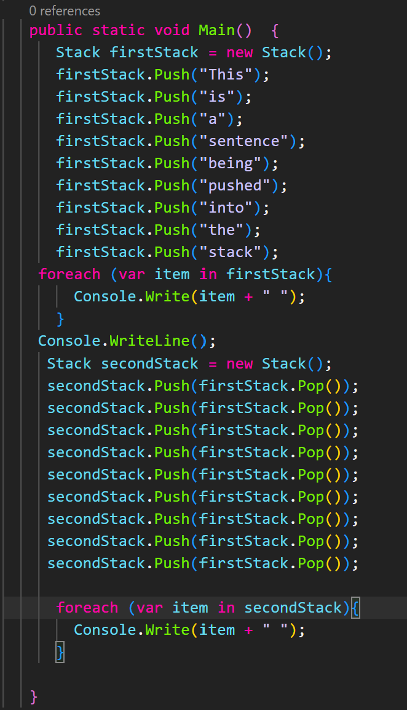  
This solution will print the sentence both in reverse order and in the correct order.  
## Problem to Solve: Periodic Table  
For this practice problem, you will be placing all of the elements of the periodic table, with their symbol and atomic number, into a slack in alphabetic order. You will push them in order, and then print them both in reverse order and then the correct order. While pushing into the stack, the element should be formatted like this "Name Symbol Atomic Number".  
This table will provide you with the elements and the correct alphabetic order.  
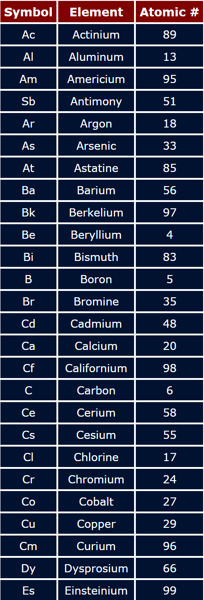  
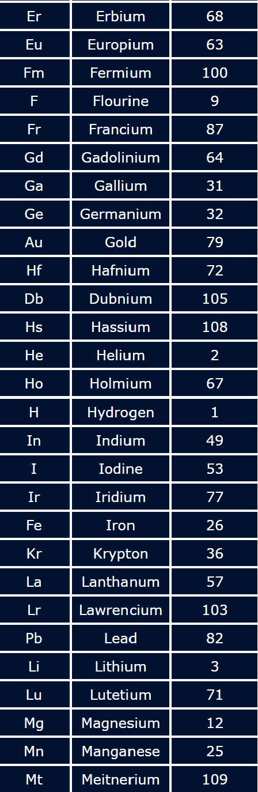  
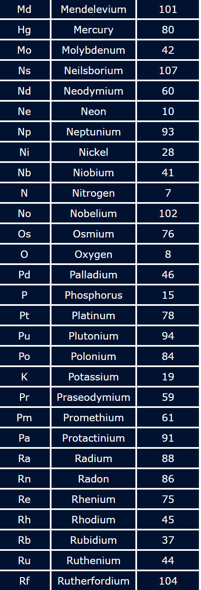  
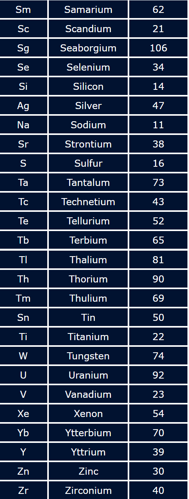  
If you are having difficulty with this problem, part of the solution can be found here:  
[Solution](stack-problem-solution/stackProblemSolution.cs)  
(Please note that only the elements from a-c are used here. For your solution, all of the elements need to be listed.)

[Back to welcome page](0-welcome.md)