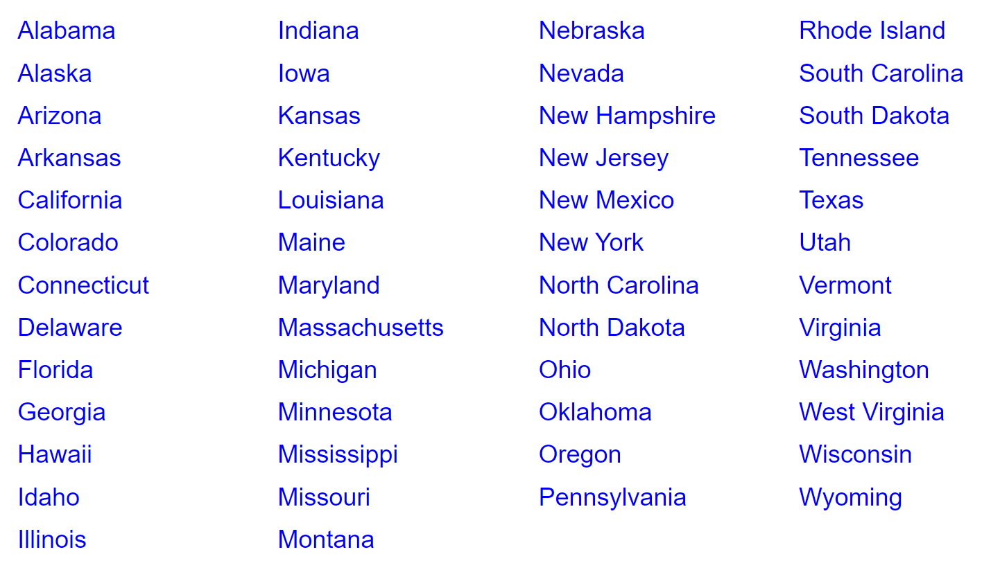

# Set
A set is a data structure that contains no duplicate elements. It is also unique is the sense that unlike many other data structures, there does not need to be a certain order in which the set is created or added to.  
  
In order to create a set a method called HashSet is used. Here is an example:  

    class Program {
    static void Main() {
        string[] arr1 = {"A","B","C","D","E"};
        Console.WriteLine(string.Join(",", arr1));

        // HashSet
        var h = new HashSet<string>(arr1);

        // eliminates duplicate letters
        string[] arr2 = h.ToArray();
        Console.WriteLine(string.Join(",", arr2));
        }
    }  

This example will print the letters A-E.  
## Hashing in Sets  
In order to add elements to a set, we would use the Add function. This will allow us to add extra elements to be printed along with the rest of the elements.  

    class Program {
        static void Main(){
            HashSet<string> newhash1 = new HashSet<string>();
            newhash1.Add("1");
            newhash1.Add("2");
        }
    }

## Open Addressing   
With open addressing, the index and the size of the array is not yet determined. It will be determined by what is already in the set. This is called separate chaining. 

    class Program
    {
      static void Main(string[] args)
      {
          var listWords = new List<string>(new string[] { "this", "is", "a", "sample", "list", "of", "words", "that", "demonstrates", "some", "code" });

          listWords = listWords.Where(w => w.Length >= 3).ToList();
          listWords = listWords.Where(word => word.ToLower().Contains("c")).ToList();
        
          Console.WriteLine(String.Join(", ", listWords.ToArray())); // Print array to console, separating each word with a comma
      }
    }

## Chaining 
Chaining is where the programming moves through the set, and removes any duplicate items that may exist in the set.  

    class Program {
    static void Main() {
        //The duplicates will be removed down below.
        string[] arr1 = {"A","A","B","B","C"};
        Console.WriteLine(string.Join(",", arr1));

        // HashSet
        var h = new HashSet<string>(arr1);

        // eliminates duplicate letters
        string[] arr2 = h.ToArray();
        Console.WriteLine(string.Join(",", arr2));
        }
    }  

## Example: Adding and Removing  
In this example I'm going to show you how to create a set, add, and remove variables.

        class Program {
        static void Main(){
            HashSet<string> newhash1 = new HashSet<string>();
            newhash1.Add("1");
            newhash1.Add("2");
            newhash1.Add("3")
            newhash1.Remove(2);
        }
    }

## Problem to Solve: 
For this problem, I would like you to create a hashset containing all of the 50 states and have the program display the set. In order to display the states, you will need to use a for loop.
Here are the 50 states.  
  
Here is a solution for this problem [Solution](set-problem-solution/Program.cs). Please keep in mind that only the states that begin with a are shown in the solution. Please provide all of the states when doing the solution.

[Back to welcome page](0-welcome.md)