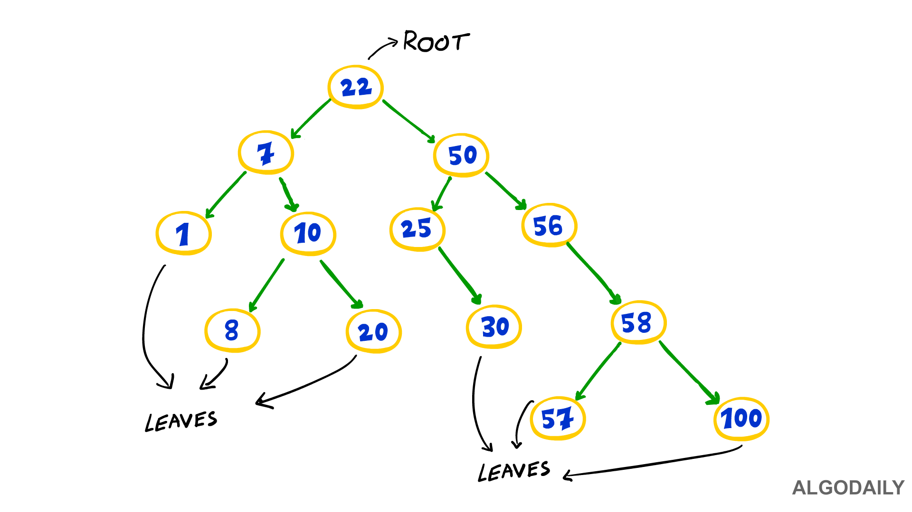
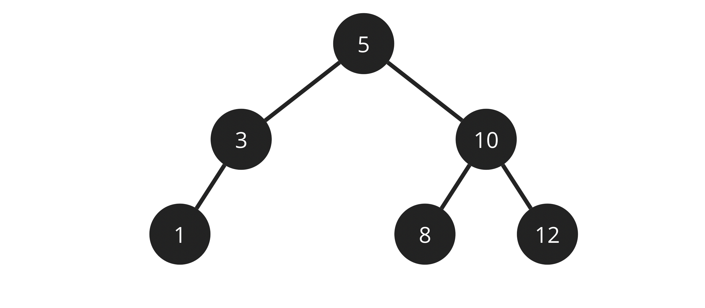

# Tree
A tree, or a binary tree is a data structure that is non-linear. It contains nodes that work hierarchically. They exist at different levels, and are connected by edges.  
  

# Root Node
The root node it the first node of the tree. There can't be a tree without the root node. It is the first part of the tree that is created, and there cannot be more than one.  

    class Node
    {
        public Node LeftNode { get; set; }
        public Node RightNode { get; set; }
        public int Data { get; set; }
    }
    class binaryTree {
        public Node Root {get; set}
    }

This is all fairly simple, we will be adding more steps in the next examples.  

# Left and Right Nodes
The left and right nodes exist to either side of the root node. They are at the end of the "edges" of the tree. The nodes to the left and the right are not connected to each other,only to any nodes that follow on their respective sides, so the data is not implemented linearly.  

    public void InsertNode (object data)
    {
        TNode newNode = new TNode(data);

        if (root.Data == null) //First node insertion  

            root = newNode;       

        else
        {
        current = root;
        while (true)
        {
            tempParent = current;
            if (Convert.ToInt45(newNode.Data) < Convert.ToInt45(current.Data))
            {
                current = current.Left;
                if(current== null)
                {
                        tempParent.Left =newNode;
                        newNode.Parent =tempParent;
                        return;
                    }
            }
            else
            {
                current = current.Right;
                if(current == null)
                {
                        tempParent.Right= newNode;
                        newNode.Parent =tempParent;
                        return;
                }
            }
            }
        }
    }

# Leaf Nodes
Leaf nodes are the nodes that exist at the ends of each branch, the ones that don't have any connecting nodes below them.  
  

# Example: Adding the Leaf Nodes  
In this example I am going to show you how to add the leaf nodes of a binary search tree together, in order to get a sum of them all.  

    using System;
    public class GFG
    {
        public class Node
        {
            public int data;
            public Node left, right;
            public Node(int data)
            {
                this.data = data;
                left = null;
                right = null;
            }
        }
        public static int sum;
        public static void leafSum(Node root)
        {
            if (root == null)
            {
                return;
            }
            if (root.left == null && root.right == null)
            {
                sum += root.data;
            }
            leafSum(root.left);
            leafSum(root.right);
        }
        public static void Main(string[] args)
        {
            Node root = new Node(1);
            root.left = new Node(2);
            root.left.left = new Node(4);
            root.left.right = new Node(5);
            root.right = new Node(3);
            root.right.right = new Node(7);
            root.right.left = new Node(6);
            root.right.left.right = new Node(8);
    
            sum = 0;
            leafSum(root);
            Console.WriteLine(sum);
        }
    }

# Problem to Solve: Simple Binary Tree
For this problem, you are going to be creating a binary tree. The right side should have 2 levels of nodes, and the left should have the same, but the first level should have two branches going off of it. These two levels do not include the root node.  
Use this diagram to get a visual idea of what the tree should look like:  
  
A solution to this problem can be found here:  
[Solution](tree-problem-solution/Program.cs)  

[Back to welcome page](0-welcome.md)

